# RailBook Train Ticket Platform

RailBook is a thesis-oriented train ticket booking system built with an ASP.NET Core Web API, Entity Framework Core, SQL Server, and a Vite React TypeScript frontend.

The project demonstrates realistic passenger ticket search and booking, non-direct itineraries, round trips, seat selection, discounts, simulated payments, PDF/QR tickets, invoices, loyalty points, refunds, and an admin control panel for railway operations.

## Solution Structure

```text
TrainTicketPlatformAPI/       ASP.NET Core Web API, EF Core models, services, controllers, migrations, seed data
train-ticket-frontend/        Vite + React + TypeScript passenger and admin frontend
TrainTicketPlatformAPI.Tests/ Backend tests for services and API behavior
PasswordHasher/               Small helper utility for password hash generation
docs/                         Supporting screenshots and documentation
```

## Architecture

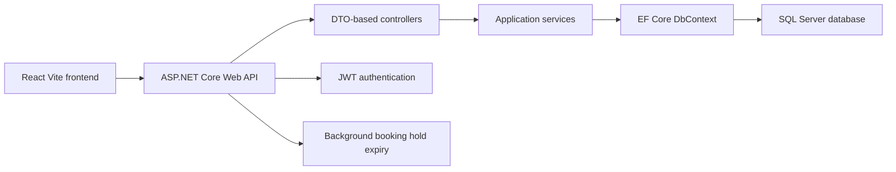

## Passenger Features

- Station autocomplete and one-way or round-trip search.
- Direct and non-direct search results with up to two transfers.
- Real route calling patterns using route stop offsets, platform, and track data.
- Class selection and segment-aware seat availability.
- Multi-passenger booking orders with multiple selected seats and one payment intent.
- Booking holds that expire automatically in the background.
- Guest checkout and logged-in passenger checkout.
- Discount selection and backend discount pricing.
- Optional dog and large baggage add-on tickets attached to the booking.
- Simulated payment using safe test tokens.
- QR ticket artifact, PDF ticket download, and ticket email delivery status.
- Combined order/ticket retrieval support for multi-passenger orders.
- My tickets with active tickets, travel history, returned tickets, refunds, and PDF download.
- Current/upcoming trip page with QR code, trip details, next stations, and disruption/delay display.
- "Moje IC" loyalty program with points earning and checkout redemption.
- Invoice generation and My invoices viewing.
- Help pages for FAQ/how-to-use, refund policy, invoice guidance, and passenger rights/obligations.

## Admin Features

- JWT-protected admin login and dashboard.
- Train manager for trainsets, locomotives, EMUs, ED250 Pendolino sets, carriage ordering, and carriage layout details.
- Route manager with ordered intermediate stops and autogenerated route code/name.
- Schedule manager with operating times, platform, track, delay minutes, cancellation reason, platform changes, and disruption banners.
- Pricing and dynamic fare management.
- Discount rule management.
- User management.
- Booking management, including admin cancellation and refund reason workflows.
- Revenue reporting.
- Admin audit logs for successful admin create/update/delete actions.

## Passenger Booking Flow

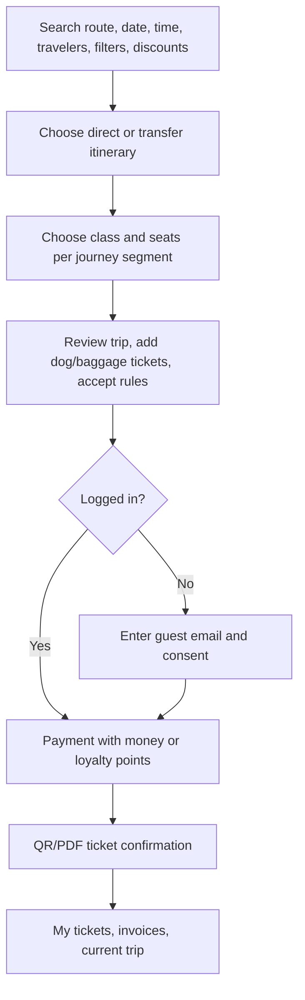

## Admin Flow

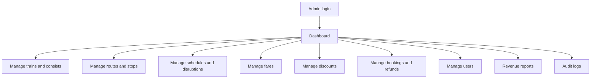

## Screenshots

### Passenger Experience

Home page with station search and booking options:

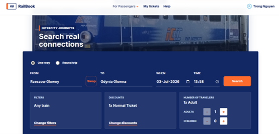

Connection results and class selection:

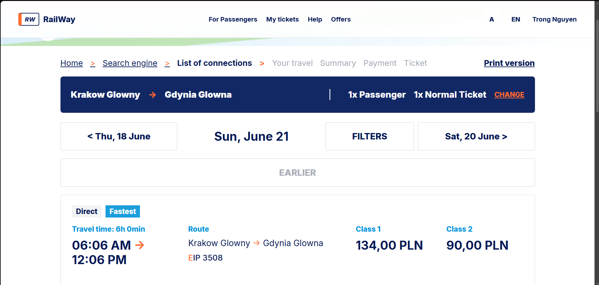

Seat selection with train consist and carriage layout:

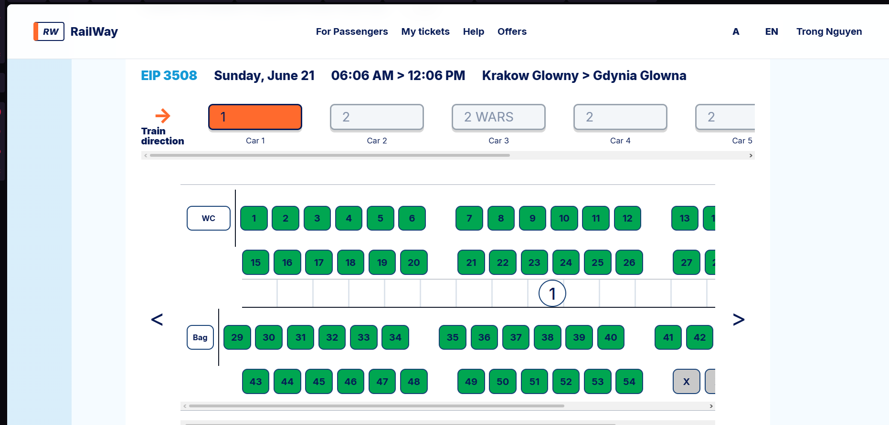

Travel summary, payment, and successful booking confirmation:

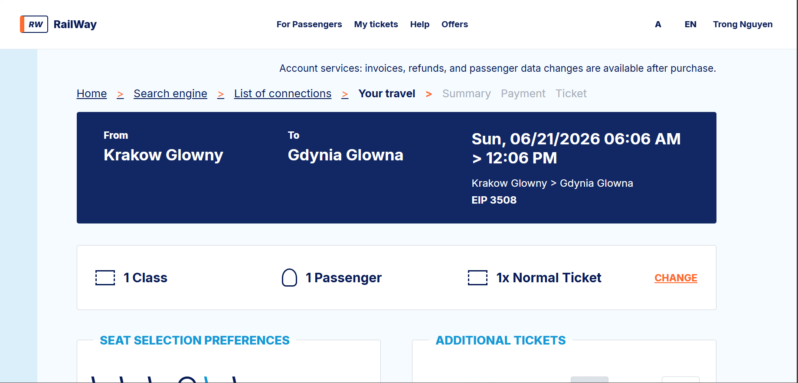

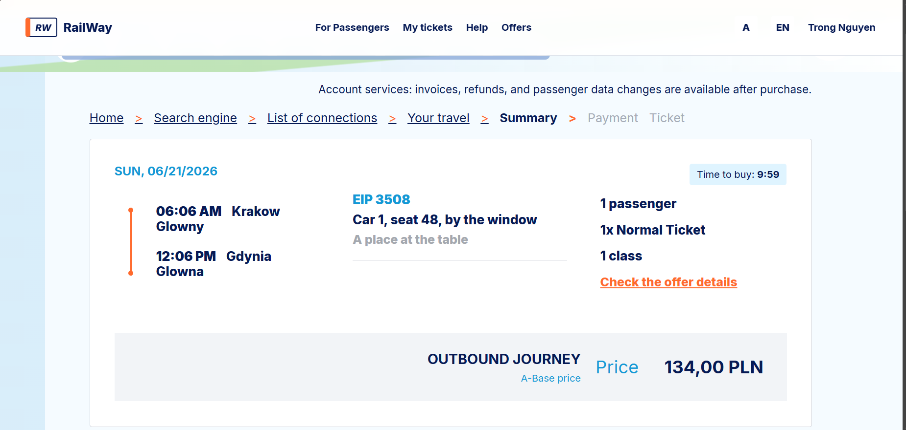

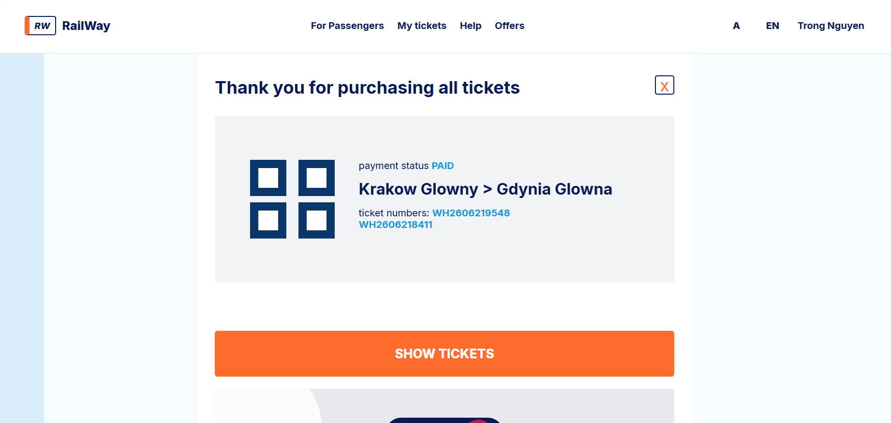

### Admin Experience

Admin dashboard and operating views for train, route, and schedule management:

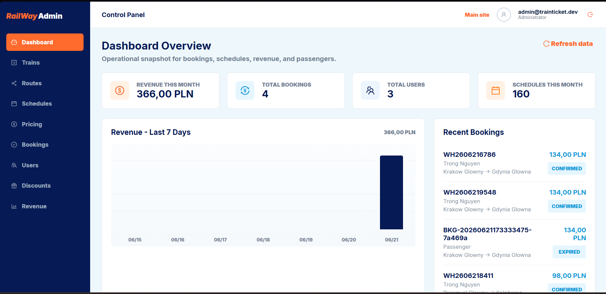

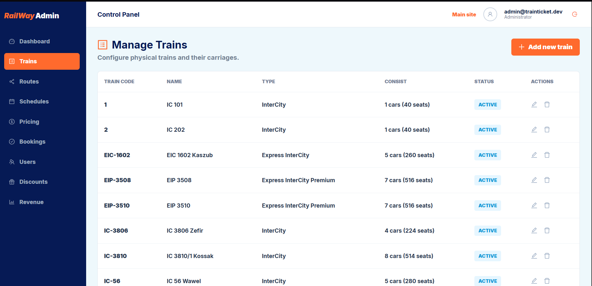


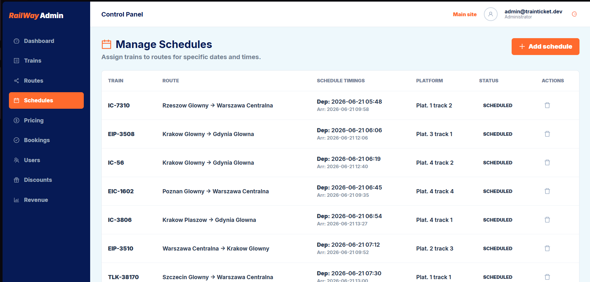

## Demo Accounts

Development seed data creates:

```text
Admin:     admin@trainticket.dev
Passenger: passenger@trainticket.dev
Password:  Password123!
```

For a real demo machine, override seed passwords with ASP.NET Core user secrets instead of committing secrets:

```powershell
dotnet user-secrets set "SeedData:AdminPassword" "<your-admin-password>" --project TrainTicketPlatformAPI
dotnet user-secrets set "SeedData:PassengerPassword" "<your-passenger-password>" --project TrainTicketPlatformAPI
```

## Run Locally

1. Configure `ConnectionStrings:DefaultConnection` in `TrainTicketPlatformAPI/appsettings.json` or user secrets.
2. Apply migrations:

```powershell
dotnet ef database update --project TrainTicketPlatformAPI --startup-project TrainTicketPlatformAPI
```

3. Start the API:

```powershell
dotnet run --project TrainTicketPlatformAPI --launch-profile https
```

4. Start the frontend:

```powershell
cd train-ticket-frontend
npm install
npm run dev
```

The frontend expects the API to be available at `https://localhost:7246` unless configured otherwise.

## Known Demo Searches

Development seed data creates schedules from the day the API seed runs. Good demo routes include:

```text
Krakow Glowny -> Gdynia Glowna
Krakow Plaszow -> Gdynia Glowna
Warszawa Centralna -> Krakow Glowny
Warszawa Centralna -> Gdansk Glowny
Rzeszow Glowny -> Warszawa Centralna
Wroclaw Glowny -> Warszawa Centralna
Poznan Glowny -> Warszawa Centralna
Przemysl Glowny -> Kolobrzeg
```

Search also accepts station codes such as `KRK`, `GDY`, `WAW`, and `RZE`.

## Test Payments

Payment is intentionally simulated for thesis/demo purposes:

```text
tok_success  confirms payment
tok_fail     records a failed payment
```

No real card numbers or payment provider credentials are used.

## Validation Commands

```powershell
dotnet build
dotnet test
cd train-ticket-frontend
npm run build
```

## Thesis Scope Notes

RailBook is suitable as an educational full-stack prototype. It shows realistic separation between frontend, API controllers, service layer, EF Core persistence, authentication, admin operations, seat inventory, booking holds, payment confirmation, refunds, invoices, loyalty points, operational disruptions, reports, and audit logs.

It is not a production ticketing system. Real deployment would still need a real payment provider, production email delivery, external timetable ingestion, stricter role/permission management, observability, backups, and security hardening.
