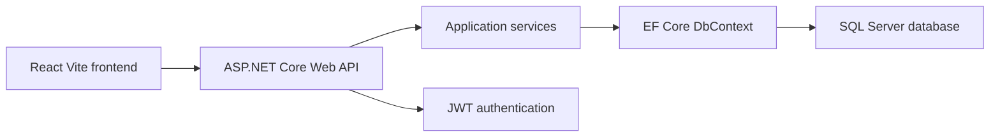
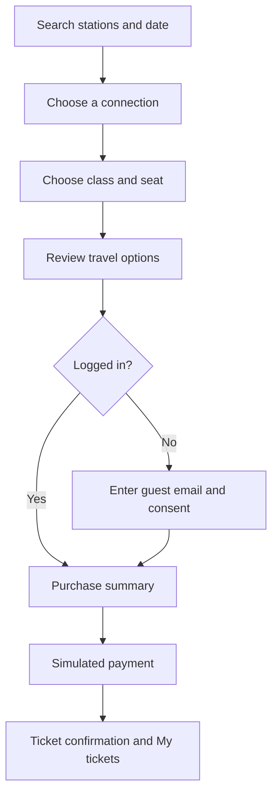
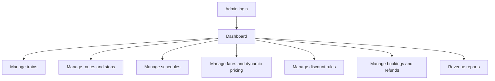

# RailWay Train Ticket Platform

RailWay is a thesis-oriented train ticket booking system built with an ASP.NET Core Web API, Entity Framework Core, SQL Server, and a Vite React TypeScript frontend.

The project demonstrates passenger ticket search and booking, guest checkout, logged-in passenger accounts, refunds, and an admin control panel for trains, routes, schedules, fares, discounts, users, bookings, and revenue reporting.

## Solution Structure

```text
TrainTicketPlatformAPI/       ASP.NET Core Web API, EF Core models, services, controllers, migrations, seed data
train-ticket-frontend/        Vite + React + TypeScript frontend
TrainTicketPlatformAPI.Tests/ NUnit tests for services and API behavior
PasswordHasher/               Small helper utility for password hash generation
```

## Architecture



## Passenger Booking Flow



## Screenshots

### Passenger Experience

Home page with station search and autocomplete-ready booking form:


Live connection results and class selection:


Seat selection with train consist and carriage layout:


Travel summary, payment, and successful booking confirmation:


### Admin Experience

Admin dashboard and operating views for train, route, and schedule management:


## Admin Flow



## Demo Accounts

Development seed data creates:

```text
Admin:     admin@trainticket.dev
Passenger: passenger@trainticket.dev
Password:  Password123!
```

For a real demo machine, override seed passwords with ASP.NET Core user secrets instead of committing secrets:

```powershell
dotnet user-secrets set "SeedData:AdminPassword" "<your-admin-password>" --project TrainTicketPlatformAPI
dotnet user-secrets set "SeedData:PassengerPassword" "<your-passenger-password>" --project TrainTicketPlatformAPI
```

## Run Locally

1. Configure `ConnectionStrings:DefaultConnection` in `TrainTicketPlatformAPI/appsettings.json` or user secrets.
2. Apply migrations:

```powershell
dotnet ef database update --project TrainTicketPlatformAPI
```

3. Start the API:

```powershell
dotnet run --project TrainTicketPlatformAPI --launch-profile https
```

4. Start the frontend:

```powershell
cd train-ticket-frontend
npm install
npm run dev
```

The frontend expects the API to be available at `https://localhost:7246` or the configured Axios base URL.

## Known Demo Searches

The development seed creates 21 days of schedules from the day the API seed runs. Good demo routes include:

```text
Krakow Glowny -> Gdynia Glowna
Krakow Plaszow -> Gdynia Glowna
Warszawa Centralna -> Krakow Glowny
Warszawa Centralna -> Gdansk Glowny
Rzeszow Glowny -> Warszawa Centralna
Wroclaw Glowny -> Warszawa Centralna
Poznan Glowny -> Warszawa Centralna
Przemysl Glowny -> Kolobrzeg
```

Search also accepts station codes such as `KRK`, `GDY`, `WAW`, and `RZE`.

## Test Payments

Payment is intentionally simulated for thesis/demo purposes:

```text
tok_success  confirms payment
tok_fail     records a failed payment
```

No real card numbers or payment provider credentials are used.

## Validation Commands

```powershell
dotnet test
dotnet build TrainTicketPlatformAPI/TrainTicketPlatformAPI.csproj
cd train-ticket-frontend
npm run build
```

## Thesis Scope Notes

This project is suitable as an educational full-stack prototype. It shows realistic separation between frontend, API controllers, service layer, EF Core persistence, authentication, admin operations, booking holds, payment confirmation, and refund workflows.

It is not a production ticketing system. Real deployment would need a production payment provider, stronger audit logging, background jobs for booking expiry, email delivery, role management hardening, and operational monitoring.
